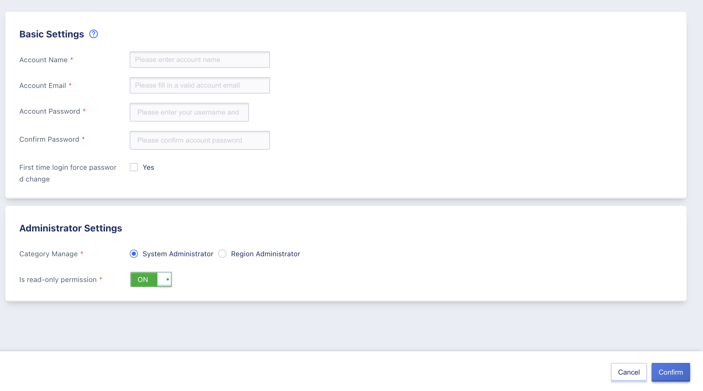
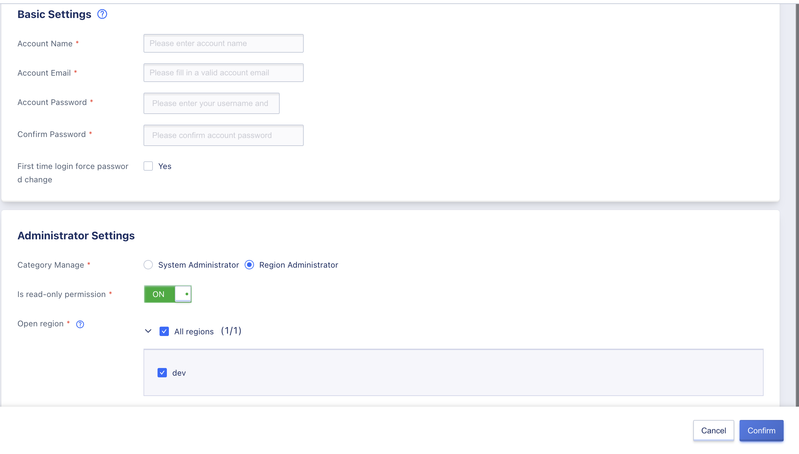
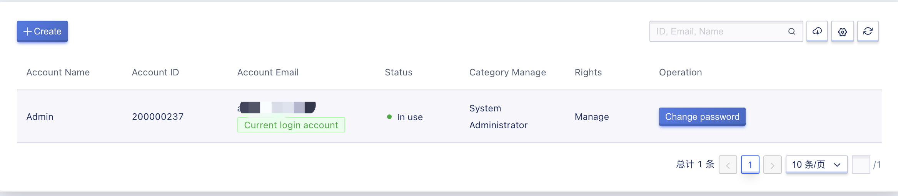
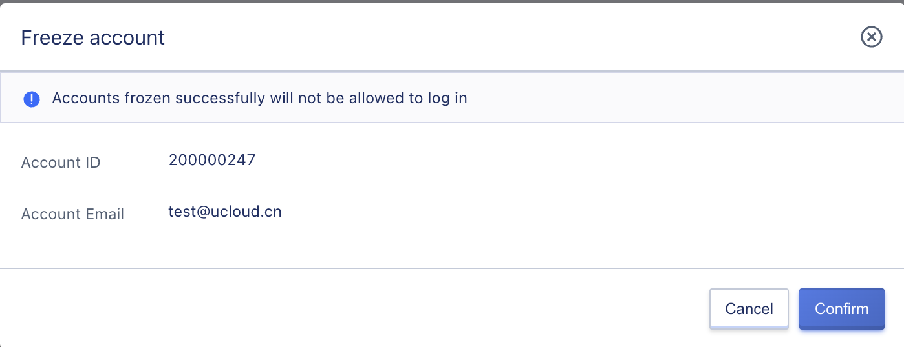
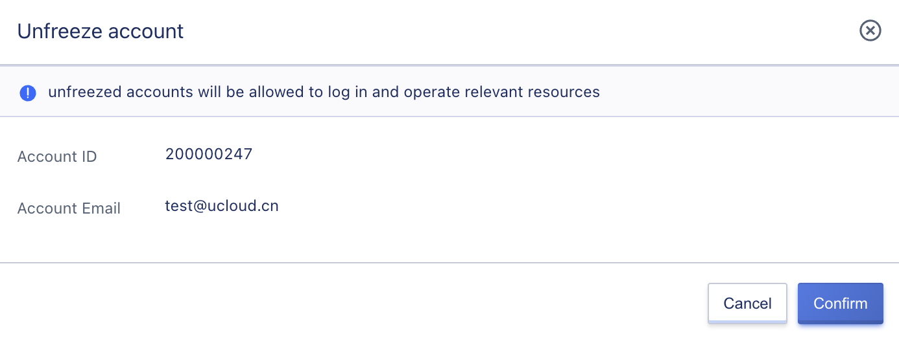
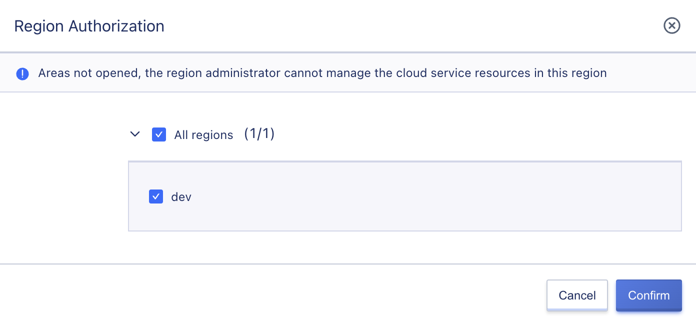
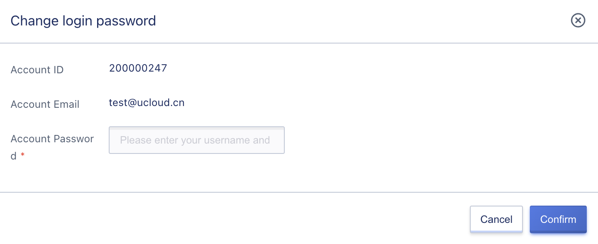
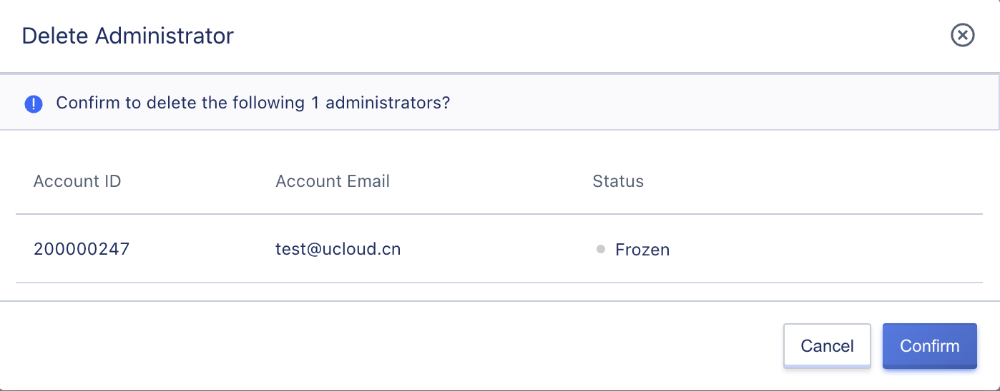

# 15 Administrator

## 15.1 Overview

The administrator is responsible for the global management and operation of the entire cloud platform. With an administrator account, it is possible to manage the regions, clusters, tenants, other administrators, resources, billing, approval processes, security, and overall platform configuration.

From a user standpoint, the system is divided into administrators and tenants, with system administrators and regional administrators both falling under the purview of administrators. The administrator role system is as follows:

| Role Level     | Default                          | Data Range      | Function Range                                                                                                                                                                                                                                                                                                                                                                                   |
|----------------|----------------------------------|-----------------|--------------------------------------------------------------------------------------------------------------------------------------------------------------------------------------------------------------------------------------------------------------------------------------------------------------------------------------------------------------------------------------------------|
| System Level   | System Administrator             | System + Region | Region Management, Cluster Management, Physical Resource Management, Cloud Resource Management, Network Service Management, Container Service Management, Account and Organization Management, Operations and Management, Monitoring Dashboard, Custom UI Management, Global Configuration Management, Service Catalog Management, Recharge Management, Order Management, Transaction Management |
|                | System Read-Only Administrator   | System + Region | Region Viewing, Cluster Viewing, Physical Resource Viewing, Cloud Resource Viewing, Network Service Viewing, Container Service Viewing, Account and Organization Viewing, Operations and Viewing, Monitoring Dashboard, Custom UI Viewing, Global Configuration Viewing, Service Catalog Viewing, Recharge Viewing, Order Viewing, Transaction Viewing                                           |
| Regional Level | Regional Administrator           | Region          | Region Management, Cluster Management, Physical Resource Management, Cloud Resource Management, Network Service Management, Container Service Management, Account and Organization Management-My Account, Operations and Management, Monitoring Dashboard, Global Configuration-Product Policy Management, Service Catalog Management, Order Management, Transaction Management                  |
|                | Regional Read-Only Administrator | Region          | Region Viewing, Cluster Viewing, Physical Resource Viewing, Cloud Resource Viewing, Network Service Viewing, Container Service Viewing, Account and Organization Management-My Account Viewing, Operations Viewing, Monitoring Dashboard, Global Configuration-Product Policy Viewing, Service Catalog Viewing, Order Viewing, Transaction Viewing                                               |

## 15.2  Creating an Administrator

System administrators can create both system administrators and regional administrators, but regional administrators cannot create administrators. When creating an administrator, it is necessary to add an account email as the administrator's account. It is possible to synchronize the account's first login to force a password change and to manage the account by choosing the type of management, whether read-only, and region activation.

## 15.2.1 Creating a System Administrator

* Account Name: The name identifying the account
* Account Email: The account's email
* Account Password: The account's login password
* Confirm Password: Confirm the account's password
* Force Password Change on First Login: Set whether the account should be forced to change its password on first login
* Management Type: The type of management for the account, either regional or system administrator
* Read-Only Permission: Whether the account has read-only permission

## 15.2.2 Creating a Regional Administrator

* Account Name: The name identifying the account
* Account Email: The account's email
* Account Password: The account's login password
* Confirm Password: Confirm the account's password
* Force Password Change on First Login: Set whether the account should be forced to change its password on first login
* Management Type: The type of management for the account, either regional or system administrator
* Read-Only Permission: Whether the account has read-only permission
* Activate Region: Activate the account in a certain region

## 15.3 Viewing the Administrator List

System administrators can view a list of all administrators on the platform and perform management operations on them.

* Account ID: The ID number of the account
* Account Email: The account's email address
* Status: The status of the account, including "in use" and "frozen"
* Management Type: The type of management for the account, either regional or system administrator
* Permission: The management permission level for the account, either management or read-only
* Creation Time: The time when the account was created
* Operation: The operations available for the account

## 15.4 Freezing an Administrator

Freezing an administrator means locking them out of the cloud platform. This action can only be performed on administrators with a status of "in use." System administrators with management permission can enter the freeze administrator wizard page from the administrator list by clicking the freeze button, as shown in the figure below:

After an account has been frozen, it must be unfrozen before normal use can resume.

## 15.5 Unfreezing an Administrator

When an administrator is frozen, their status is set as frozen. System administrators with management permissions can unfreeze the administrator, as shown in the following figure:

After the administrator is unfrozen, they can log in to the console normally.

## 15.6 Region Authorization Management

Through region authorization management, you can manage the authorization of a regional administrator in the region. Only in the authorized region can the regional administrator use the service normally. Enterprises can manage the opening of system administrators in corresponding regions based on the actual operation of the cloud platform.

## 15.7 Changing Passwords

System administrators with management permissions can change the password of an administrator account to adapt to the scenario where the administrator forgets their password. System administrators with read-only permissions can only modify their own account passwords.

## 15.8 Deleting Administrators

System administrators with management permissions can delete administrator accounts. After an administrator account is deleted, it cannot log in to the platform again.

