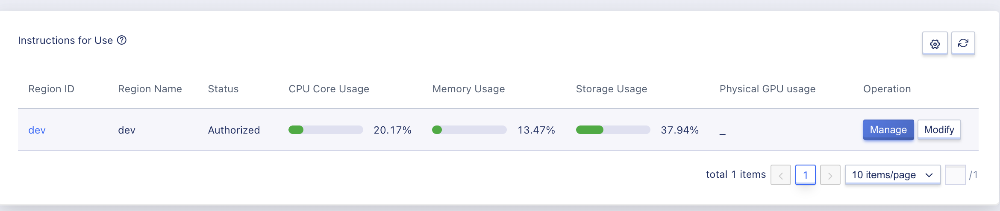
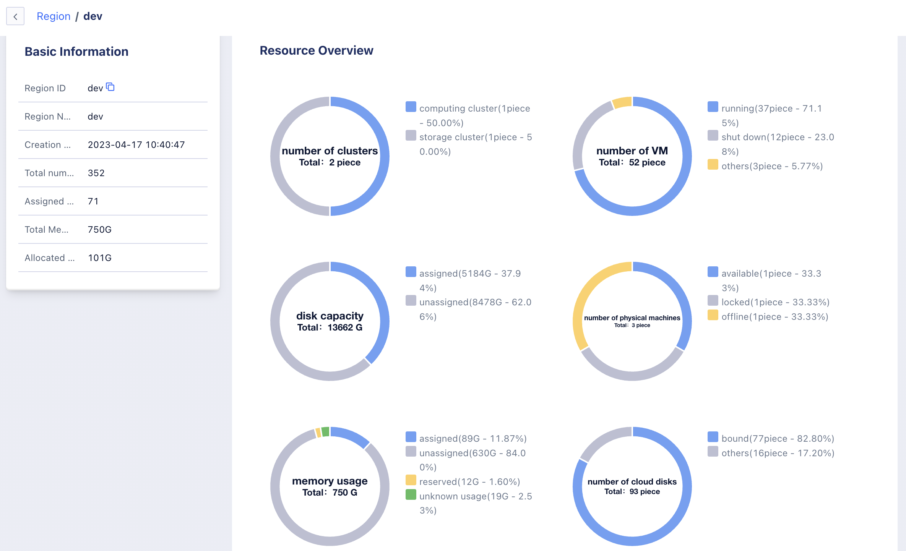
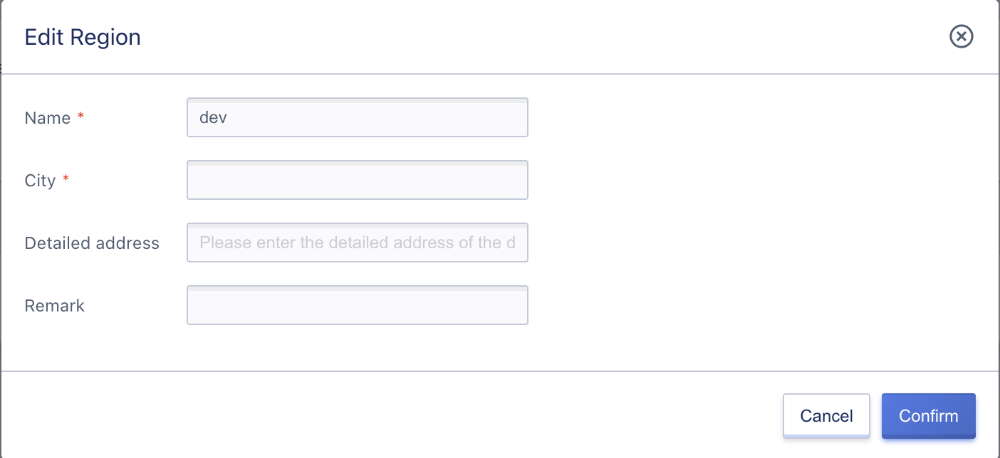

# 3 Region Management

A region is a logical concept in the cloud platform, referring to the classification of physical locations where resources are deployed, which can correspond to cabinets, computer rooms, or data centers. Typically, one data center corresponds to a private cloud platform that supports the deployment of multiple computing and storage clusters. The resources and networks between data centers are completely physically isolated and can be managed through a management platform that spreads across private cloud platforms in various locations.

Regions are also known as data centers in the platform, and data centers are usually completely isolated from each other to ensure maximum stability and fault tolerance. As the largest resource definition in the platform, a region deploys a set of private cloud platforms. The management service uses the API endpoint provided by the local data center cloud platform to manage computing, storage, and network resources within the region. It supports lifecycle management of resources in the data center, including computing clusters, storage clusters, external storage, basic images, and self-made images.

## 3.1 View Regions

### 3.1.1 Region List

You can enter the region list page by clicking on "Region Management" in the left sidebar of the administrator console. You can view the current list of regions, including region ID, region name, city, detailed address, CPU core usage, memory usage, storage usage, physical machine GPU core number, GPU usage, status, EndPoints, creation time. You can also customize the information required for the custom list by clicking the "Custom List" button, as shown in the following figure:

- Region ID: The unique identifier of the region in the platform, such as cn, is usually used as the request parameter value for the API interface.
- Region Name: The name of the region, which can be distinguished by independent naming for different regions, such as Beijing Data Center No. 1 computer room.
- City: The city where the data center is located.
- Detailed Address: The detailed address of the data center.
- CPU Core Usage: Display the total, used, and available number of CPU cores.
- Memory Usage: Display the total, used, and available memory.
- Storage Usage: Display the total, used, and available storage.
- Physical Machine GPU Core Number: Display the total, used, and available GPU core numbers.
- Status: Displays the region's license authorization status, including unauthorized/authorized/expired authorized.
- Creation Time: The creation time of the region.

> If the proportion of allocated vCPUs and memory for a region exceeds 80%, it means that there are fewer available vCPU and memory resources under the region, and expansion is usually needed. You can also calculate the usage rate of tenant cloud resources and release cloud resources in a timely manner to ensure that users who really need to use resources can be assigned to cloud resources.

### 3.1.2 Region Details

You can click on the region name in the region list or click the "Manage" button on the right side of the target region list to enter the overview page of the current region and view its basic information and monitoring information, as shown in the following figure:

The overview page displays basic information and monitoring charts of the region's core resource usage trends.

* Basic Information: Primarily display basic information such as region ID, region name, creation time, EndPoint, total cores, allocated cores, total memory, and allocated memory.
* Monitoring Information: You can view the monitoring information of the region, including computing instance numbers (total/running/stopped), CPU cores (total/used/available), memory capacity (total/used/available), and EIP counts (total/used/available). You can use the filter button to adjust the display time period of the chart to meet the demand for viewing the core resource usage trend of the region based on different time granularities.

## 3.2 Modify Regions

Administrators can modify the name, city, detailed address, and remarks of a region. The name is displayed in the region filtering of the tenant console, and the city, detailed address, and remarks can be used to supplement more information about this data center. In the management platform region management list, click the "Modify" button on the right side of the corresponding region to perform the operation, as shown in the following figure:

