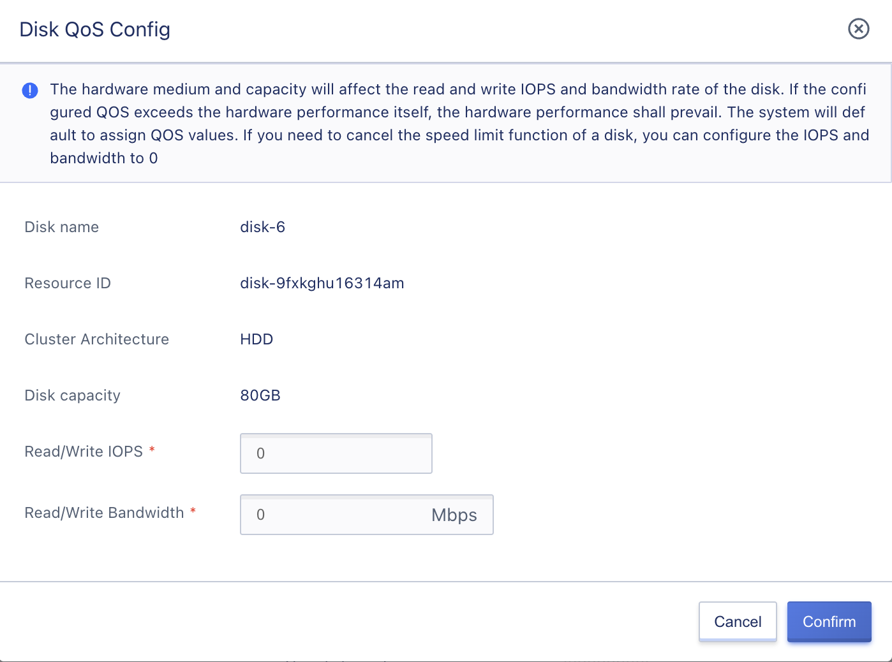

# 6 Virtual Resource Management

The platform provides administrators with full lifecycle operation and management capabilities for virtual resources of all tenants on the platform, allowing administrators to centrally control the overall virtual resources of the platform, including all tenant-side product services such as virtual machines, VM templates, elastic network cards, VPC networks, public IPs, VIPs, security groups, load balancers, NAT gateways, VPN gateways, external storage, cloud disks, snapshots, etc. Additionally, the platform also supports QoS control for single disk IOPS and read/write bandwidth.

## 6.1 Virtual Machine Management

The platform supports administrators in assigning tenants to create virtual machines with Windows, Ubuntu, and CentOS operating systems, and the created virtual machines belong to the specified tenant.

Administrators are also able to manage the full lifecycle of virtual machines for all tenants on the platform, including viewing virtual machine details, USB device information, VNC login, startup/restart/shutdown/power off, password reset, system disk expansion, image creation, system reinstallation, binding public IPs, unbinding public IPs, setting default egress, modifying internal/external network security groups, mounting cloud disks, renewing, modifying virtual machine configurations, hot upgrades, obtaining console information, modifying names and comments, modifying alarm templates, and deleting/destroying virtual machines.

## 6.2 Resource Templates

The platform supports administrators in assigning tenants to create resource templates, and the created resource templates belong to the specified tenant. Administrators can also manage the full lifecycle of resource templates for all tenants on the platform, including viewing, creating resources, updating, cloning templates, and deleting, etc.

## 6.3 Elastic Network Card Management

The platform supports administrators in assigning tenants to create elastic network cards, and the created elastic network cards belong to the specified tenant. They can only be bound to the tenant's virtual machines. Administrators can also manage the full lifecycle of elastic network cards for all tenants on the platform, including viewing, binding, unbinding, modifying security groups, adjusting IP bandwidth, renewing, and deleting, etc.

## 6.4 VPC Network Management

The platform supports administrators in assigning tenants to create VPC networks and subnets, and the created VPCs and subnets belong to the specified tenant. When creating virtual resources, only the VPC and subnet resources that the tenant owns can be selected. Administrators can also manage the full lifecycle of VPC networks and subnets for all tenants on the platform, including viewing, deleting, creating subnets, and deleting subnets, etc.

## 6.5 Public IP Management

The platform supports administrators in assigning tenants to apply for public IP addresses in a designated IP address range. The applied IP addresses belong to the specified tenant and only support the application of IP addresses from the IP address range that the tenant has permission to use. Administrators can also manage the full lifecycle of public IP addresses for all tenants on the platform, including viewing, binding, unbinding, modifying bandwidth, renewing, modifying alarm templates, deleting, etc.

## 6.6 Security Group Management

The platform supports administrators in assigning tenants to create security groups, and the created security groups belong to the specified tenant. They can only be bound to virtual resources belonging to the same tenant as the security group. Administrators can also manage the full lifecycle of security groups for all tenants on the platform, such as managing IP groups and port groups.

## 6.7 Load Balancer Management

The platform supports administrators in assigning tenants to create load balancer instances, and the instances belong to the specified tenant. Only virtual machine resources that the tenant has permission to access may be added to the service node. Administrators can also manage the full lifecycle of load balancers for all tenants on the platform, such as managing VServer, service nodes, domain forwarding policies, and SSL certificate management.

## 6.8 NAT Gateway Management

The platform supports administrators in assigning tenants to create NAT gateway instances, and the instances belong to the specified tenant. Only virtual resources that the tenant has permission to access may be added to SNAT and DNAT rules. Administrators can also manage the full lifecycle of all NAT gateways on the platform, such as managing SNAT and DNAT rules for all NAT gateways.

## 6.9 Disk Management

### 6.9.1 Tenant Cloud Disk Management

The platform supports administrators in assigning tenants to create cloud disks, and the created cloud disks belong to the specified tenant. Only cluster types that the tenant has permission to use may be selected for cloud disk creation. Administrators can also manage the full lifecycle of cloud disks for all tenants on the platform, including viewing, binding, unbinding, expanding, creating snapshots, cloning, rolling back, renewing, configuring QoS, and deleting, etc. Deleted cloud disks will be transferred to the tenant's recycle bin, and only virtual machines bound to the same tenant as the cloud disk can be bound. Snapshots created belong to the tenant.

### 6.9.2 Cloud Disk QoS

The platform provides a global default QoS configuration for all cloud disks, which assigns a QoS value based on a platform formula when a new disk is created, limiting platform users from forcibly occupying disk performance. At the same time, the platform supports administrators to customize QoS values for cloud disks for all tenants on the platform. Customized QoS values for each cloud disk only take effect when the global QoS configuration is enabled.

After each cloud disk is created, administrators can configure "QoS" for it on the Cloud Resource Management-Cloud Disk List page. They can also configure QoS for the system disk in the details of a virtual machine. The QoS settings that can be configured include:

* Read/write IOPS

  When the disk architecture is HDD, the range of read/write IOPS that can be set is `0-50000`, with a default value of 1000, and a configuration of 0 means no speed limit.

  When the disk architecture is SSD, the range of read/write IOPS that can be set is `0-50000`, with a default value calculated according to the current disk capacity. A configuration of 0 means no speed limit.

- Read/write bandwidth (MBps)

  When the disk architecture is HDD, the range of read/write bandwidth that can be set is `0-1000Mbps`, with a default value of 100, and a configuration of 0 means no speed limit.

  When the disk architecture is SSD, the range of read/write bandwidth that can be set is `0-1000Mbps`, with a default value calculated according to the current disk capacity. A configuration of 0 means no speed limit.

After the disk capacity is expanded, the QoS value for the new capacity is recalculated according to the calculation formula, and the QoS for the disk is reset based on the calculated QoS value.

- If the QoS value set before the disk capacity is expanded < the new capacity QoS value, the new capacity QoS value takes effect.
- If the QoS value set before the disk capacity is expanded > the new capacity QoS value, the pre-expansion setting takes effect.

> Hardware media and capacity will affect the disk's read/write IOPS and bandwidth rate. If the configured QoS exceeds the hardware's own performance, the hardware performance will take precedence. The system assigns a default QoS value. To cancel the speed limit function for a disk, both IOPS and bandwidth should be set to 0.

## 6.10 Snapshot Management

The platform supports administrators in viewing and managing cloud disk snapshot resources for all tenants on the platform, such as creating, rolling back, and deleting snapshots. Snapshots can only be rolled back to the original cloud disk.

## 6.11 External Storage Management

The platform supports administrators in viewing and managing all LUN storage volumes allocated to tenants on the platform. Administrators can also bind and unbind LUN devices for storage volumes. Only LUN devices bound to virtual machine instances belonging to the respective tenant may be bound, providing data disk services for virtual machines belonging to the respective tenant.

When helping a tenant create a virtual machine, administrators can also select authorized external storage LUN devices as the system disk of the virtual machine.

## 6.12 VPN Gateway

Supports administrators to specify tenants to create VPN gateway instances, which belong to the specified tenant and only allow adding virtual resources that the specified tenant has permission to access. At the same time, administrators can manage all VPN gateways on the platform, such as managing the peer gateway and tunnels of VPN gateways.

## 6.13 VIP

Supports administrators to specify tenants to create VIP instances, which belong to the specified tenant and only allow associating with virtual resources that the specified tenant has permission to access. At the same time, administrators can manage all VIPs on the platform, such as updating and deleting all VIPs.

## 6.14 App Store

Supports administrators to install applications for specific tenants, and the installed application instances belong to the specified tenant. Currently, there are only two applications available: EDR for terminal detection and UDAS for database auditing, and only support installation and deployment.

## 6.15 File Storage

Supports administrators to create file storage instances for tenants on the console, install file storage clients in virtual machine instances, use standard mount commands to mount the created file system, and share files among multiple instances. The platform supports administrators to customize QoS values for file storage for all tenants on the platform.

## 6.16 Object Storage

Supports administrators to create file storage instances for tenants on the console, and use object storage to access any type of data at any time and any place. The platform supports administrators to customize QoS values for object storage for all tenants on the platform.

## 6.17 Isolation Group

Isolation group is a simple orchestration strategy for virtual machine resources, which supports instances within or between groups to be dispersed to different physical machines to ensure high availability of business. The platform supports administrators to create isolation groups with the policy object type of node groups, and support affinity and anti-affinity policies between virtual machines and node groups.

## 6.18 Multicast

Supports administrators to specify tenants to create multicast instances, which belong to the specified tenant and only allow associating with virtual resources that the specified tenant has permission to access. At the same time, administrators can manage all multicasts on the platform, such as updating and deleting all multicasts.

## 6.19 Monitoring Alarm

Supports administrators to view and manage monitoring alarm resources for all tenants on the platform, create alarm templates, view alarm records, provide real-time monitoring data and chart information for all resources, and notify and warn via email when a resource failure or monitoring metric exceeds the alarm threshold.

## 6.20 Resource Event

Supports administrators to view resource events for all tenants and manage notification rules for tenants, such as creating, updating, and deleting notification rules.

## 6.21 Redis

Supports administrators to specify tenants to create Redis, which belongs to the specified tenant and supports full lifecycle management of Redis for all tenants on the platform, such as renewal, creating replicas, upgrading memory, and deletion.

## 6.22 MySQL

Supports administrators to specify tenants to create MySQL, which belongs to the specified tenant and supports full lifecycle management of MySQL for all tenants on the platform, such as renewal, creating replicas, upgrading memory, and deletion. The platform supports administrators to customize QoS values for MySQL for all tenants.

## 6.23 Backup Service

Supports administrators to bind storage pools and create backup plans for specific tenants, and the storage pool and backup plan belong to the specified tenant. At the same time, administrators can manage the full lifecycle of storage pools and backup plans for all tenants on the platform, such as binding and unbinding storage pools, executing and deleting backup plans, etc.

